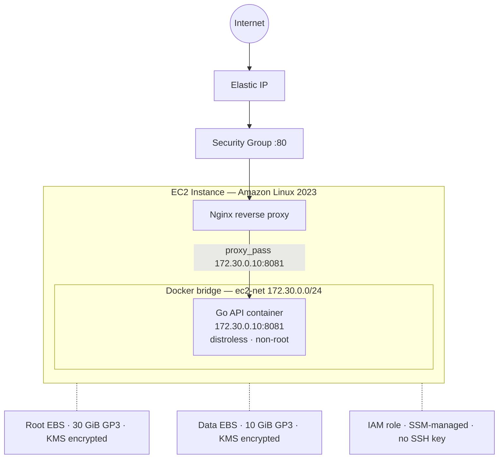
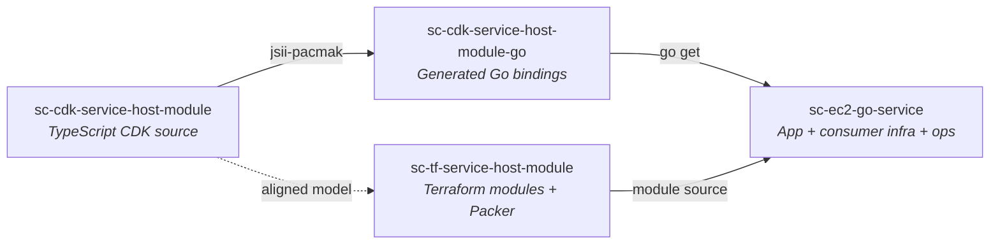
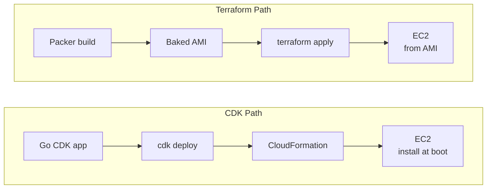
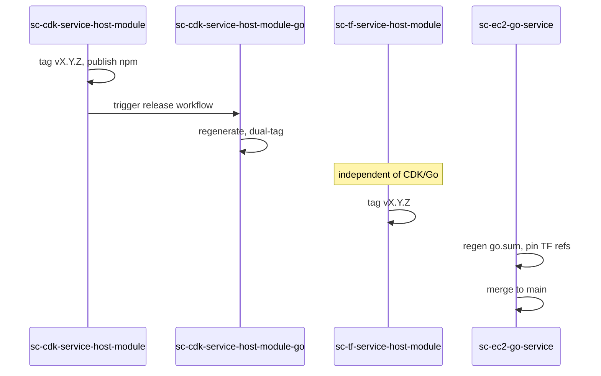

# Engineering Reference

A formal reference for the architecture, design decisions, and deployment model behind this project. For the informal development narrative, see [PROJECT.md](PROJECT.md).

---

## Architecture Overview

Public runtime contract:

| Route | Response |
|-------|----------|
| `GET /api/v1` | `{"message":"<random word>"}` |
| `GET /health` | `{"status":"ok"}` |
| `GET /version` | Build metadata JSON |
| `GET /_nginx/health` | Nginx-direct diagnostic (not proxied) |
| Everything else | `404 Not Found` |

---

## Four-Repo Split

The project is split across four repositories modelling a platform-team / service-team ownership boundary.

| Repo | Role | Owner Analogy |
|------|------|---------------|
| [`sc-cdk-service-host-module`](https://github.com/Bh-an/sc-cdk-service-host-module) | CDK construct library (TypeScript) | Platform team |
| [`sc-cdk-service-host-module-go`](https://github.com/Bh-an/sc-cdk-service-host-module-go) | Generated Go wrapper via JSII | Platform team |
| [`sc-tf-service-host-module`](https://github.com/Bh-an/sc-tf-service-host-module) | Terraform modules + Packer AMI pipeline | Platform team |
| [`sc-ec2-go-service`](https://github.com/Bh-an/sc-ec2-go-service) | Go app, consumer infra, operator surface | Service team |

The split reflects real dependency boundaries: platform modules are versioned, tagged, and consumed as external dependencies — not local code paths.

---

## CDK as Primary, Terraform as Secondary

Both paths produce the same deployed state. CDK is the primary path because:

- No AMI build dependency — installs Docker/Nginx at boot via user data
- The construct library publishes as npm + Go module via JSII
- CloudFormation handles state — no S3 backend to manage

Terraform is kept because it was the familiar starting path, it demonstrates the Packer workflow, and some teams genuinely prefer managing infra that way.

> [!NOTE]
> Root volume size is aligned at 30 GiB across both paths. The baked AMI path proved during live testing that the host contract needs `>=30 GiB`, so the CDK default was matched.

---

## JSII and the Go Wrapper

The CDK module uses Projen's `AwsCdkConstructLibrary` with JSII bindings. TypeScript constructs are automatically packaged for Go via `jsii-pacmak`.

**Trade-offs:**

- JSII enforces strict API constraints — no union types, no overloaded functions
- The Go wrapper needs its own repo because Go module resolution requires the import path to match a real GitHub repository
- Dual tagging is required: `vX.Y.Z` (repo tag) and `cdkservicehostmodule/vX.Y.Z` (Go module tag)
- Version pinning across four repos creates a strict release ordering

> [!IMPORTANT]
> Missing the subdirectory tag (`cdkservicehostmodule/vX.Y.Z`) will break `go get` for consumers.

---

## Packer AMI Pipeline

The Terraform path uses a Packer-baked AMI where Docker and Nginx are pre-installed. The CDK path installs them at boot.

| Aspect | CDK (install at boot) | Terraform (baked AMI) |
|--------|----------------------|----------------------|
| Dependency chain | Simpler — no AMI to manage | Requires Packer build step |
| Boot speed | ~3-5 min extra for dnf install | Fast — packages pre-installed |
| Failure surface | Network, package repo availability | AMI is a known tested artifact |
| Package freshness | Latest on every deploy | Frozen at bake time |

The SSM Parameter Store integration (`/sc/ec2-go-service/{env}/ami-id`) pins a tested AMI ID rather than always using the latest build. This is the production-grade pattern.

---

## Operator Surface

The service repo exposes its entire operational surface through `Makefile` → `scripts/<action>.sh` → `scripts/common.sh`.

`common.sh` holds every constant: GHCR image name, S3 bucket naming pattern, SSM parameter path template, CDK bootstrap stack name. One place to update if something changes.

The operator model includes:
- `doctor` for readiness checks
- `bootstrap` for first-time setup (CDKToolkit, S3 state bucket)
- `deploy-cdk` / `deploy-terraform` with automatic verification
- `smoke` / `verify-*` with exponential backoff through the bootstrap window
- `cleanup-*` with `infra` and `full` modes
- Post-deploy summaries on both success and failure

---

## Security Posture

| Control | Detail |
|---------|--------|
| IMDSv2 | Required, hop limit 1 (containers blocked from IMDS) |
| KMS | Customer-managed key with rotation enabled |
| EBS encryption | Both root and data volumes |
| Instance access | SSM-first, no SSH key pair by default |
| Container image | Distroless, non-root (`1001:1001`) |
| Egress | Allow-all (container needs GHCR pull access) |

---

## Release Coordination

Step 2 depends on step 1 (Go bindings generated from tagged TypeScript source). Step 4 depends on steps 2 and 3 (service repo's `go.mod` and Terraform sources must resolve against published tags).

---

## What Would Change at Scale

| Current choice | Production alternative |
|---------------|----------------------|
| Single AZ | Multi-AZ for availability |
| Direct EIP on CDK path | ALB in front (PrivateServiceHost can sit behind a caller-managed ALB) |
| Public GHCR | Private ECR or authenticated GHCR |
| NAT Gateway optional | Required for private hosts with outbound needs |
| `BACKEND=local` fallback | S3-only in team settings |
| No monitoring | CloudWatch alarms, log aggregation via `log/slog` JSON output |

---

## Verification Status

Last verified: `2026-03-27`

Verification matrix

| Capability | Status |
|---|---|
| Public CDK deploy / verify / cleanup | `live-verified` |
| Public Terraform deploy / verify / cleanup | `live-verified` |
| Packer AMI bake + SSM publish | `live-verified` |
| CDK shared module v0.3.4 / Go wrapper v0.3.4 | `live-verified` |
| Terraform shared module v0.3.7 | `live-verified` |
| Private CDK host behind ALB | `live-verified` |
| Private Terraform deploy / runtime / cleanup | `live-verified` (runtime proven via on-host SSM smoke) |
| Caller-managed Terraform host | `local-validated` (plan only) |
| `cleanup-cdk MODE=full` | `reviewed-only` |
| `cleanup-terraform MODE=full` | `not exercised` |
| `AUTO_CLEANUP_ON_INTERRUPT` | `not exercised` |
| GitHub Actions workflows | `test`, `publish-image`, `deploy-cdk`, and `deploy-terraform` were exercised; the AWS deploy workflows are fully configured, but currently disabled on `main` |

---

*Engineering reference as of the v0.3.x release line.*
