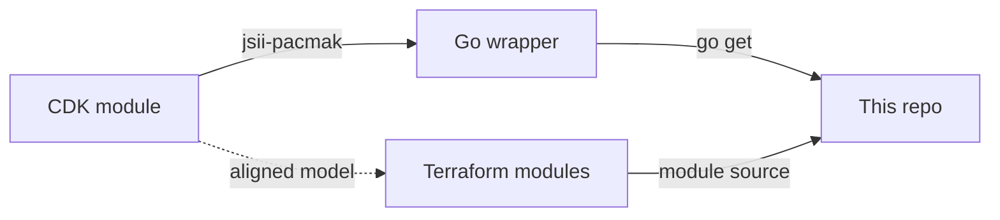
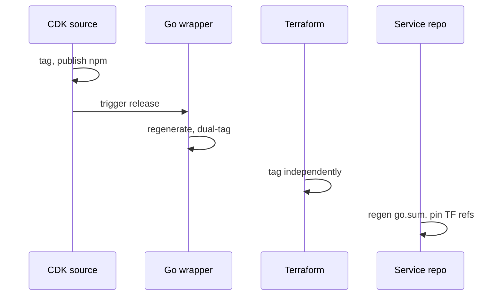

# How This Got Built

What happened during development and why things ended up the way they did.

---

## The Assignment

EC2 with a public IP, KMS-encrypted EBS, dynamic AMI, Go app in Docker on 8081, and Terraform. A single root module would have covered it.

I wanted to build something on top of it from the start. The shape of what that meant changed a lot along the way.

## How It Evolved

I started with Terraform because that's what I was most familiar with. I already had reusable modules from previous projects, so the Terraform side came together relatively quickly with a proper module split.

More than midway through, I came across the smallcase infrastructure repos. The patterns there were interesting and not something I'd worked with much before, so I pivoted and started building toward that. CDK, JSII, published construct libraries, generated Go bindings. The repo structure, the segregation between platform modules and consumer repos, the operator surface, all of that came together as the project evolved and as I kept wanting a simpler user-facing setup experience.

The versioning reflected how iterative this was.



## CDK

The assignment asked for Terraform. I added CDK as the primary path because it seemed like an interesting approach, it was something I wasn't super familiar with, and I thought matching it to smallcase's patterns would be more appreciated.

My only prior experience with anything similar was minimal Pulumi work a while back. CDK and JSII were new territory.

Both paths deploy identical infrastructure. Terraform stays because it was required and because the Packer AMI workflow is worth showing on its own.

## JSII

Completely new to me. First time with JSII, first time with Projen, first time publishing Go module release workflows instead of just consuming them. Docs and trial and error, mostly.

The constraints came up during implementation. JSII doesn't allow union types, overloads, or certain generics in your API surface. I had to restructure interfaces a few times. The Go wrapper needs its own repo because Go module resolution requires the import path to match an actual GitHub repository. Dual tagging caught me too: every release needs both the repository tag and the subdirectory module tag, forget the subdirectory tag and `go get` just breaks.

Setting up the checksum management and release workflows as a publisher rather than a consumer was the part that took the most learning.



I'd use JSII again. The publish story is worth the overhead.

## Bake vs Boot

I planned for a Packer-based build from the start. CDK installs Docker and Nginx at boot through user data, Terraform uses a baked AMI. Both approaches could work with either path. The name filter querying could work with Terraform too, and CDK could consume a baked AMI. I just haven't brought the two to parity yet.

Ideally the decision of bake vs boot should be the team's choice, not baked into the module design. Best thing would be to give both options on both paths.

Boot-time install is simpler but adds 3-5 minutes for package installation. Baked AMI is faster and closer to production, but needs the Packer build step.

Small bugs would crop up and require a full release cycle across repos to verify fixes, which was mind-numbing.

## Operator Surface

I've used the Makefile pattern before but this is probably the most fleshed out version. The reusable patterns came as the project evolved. Having both Terraform and CDK paths usable from one repo made me invest proper time into making the operator surface actually useful and allow easy project setup anywhere.

Started with bootstrap and deploy, then grew to include `doctor` for readiness checks, `smoke` with exponential backoff through the bootstrap window, and post-deploy summaries that print everything you need whether the deploy succeeded or not. The auto-cleanup flags came after too many manual teardowns of failed deployments. The interrupt handler hasn't been tested as thoroughly as the rest.

## Runtime

```
Internet → EIP → EC2 → Nginx :80 → Docker bridge 172.30.0.0/24 → Container :8081
```

Nginx on the host was locked in for me from the start given the EC2 requirement. If I'd planned ALB from the beginning I might have reconsidered, but Nginx at the host level is useful beyond simple proxying. It can handle inter-service comms, auth, TLS termination, streaming, general proxy work. It's a good layer to have between the user and your service.

Container on a bridge network with a static IP (`172.30.0.10`) so Nginx's upstream is a hardcoded address. No service discovery, no DNS. The container doesn't bind to a host port because that would expose 8081 publicly and bypass Nginx.

Routes: `/api/v1`, `/health`, `/version`, everything else 404. One diagnostic route (`/_nginx/health`) served by Nginx directly.

## Security

Standard guardrails from work, nothing special for the assignment. IMDSv2 required with hop limit 1 so containers can't reach instance metadata. Customer-managed KMS key with rotation. Both volumes encrypted. SSM for access instead of SSH keys. Distroless container image, non-root user. Egress is allow-all because the container needs GHCR access and the app doesn't make outbound calls.

## What I'd Change

Most of the "gaps" here are just example config choices, the modules already support more than what's used in the default deployment:

- **Multi-AZ** is already supported, the example configs just use `maxAzs: 1` / a single AZ. Changing it is a config value, not a code change.
- **Private hosts behind ALB** are already available through `PrivateServiceHost` (CDK) and `exposure_kind = "private"` (Terraform). The public EIP path is the example default.
- **Bake vs boot parity** across both deployment paths. Right now CDK does boot-install and Terraform does baked AMI. Both should offer both options.
- **Response counter metrics** on the randomiser endpoint. Simple counters for how often each word gets returned.
- **CI/CD and PR automation** could be more fleshed out. PR-based workflows, automated checks, the dev workflow in general.
- **S3-only for Terraform state.** `BACKEND=local` exists for convenience but shouldn't be an option in a team setting.

---

*As of the v0.3.x release line.*
