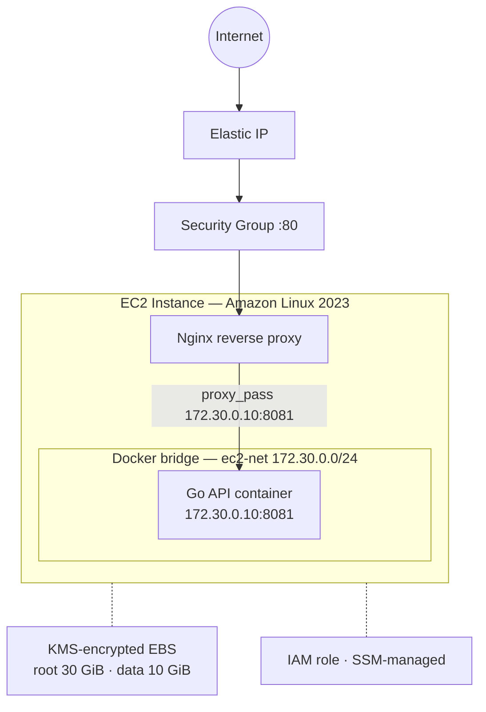

# sc-ec2-go-service

The application and operator repo for the Go API service. This is the main entrypoint for running the assignment, publishing the image, deploying with CDK or Terraform, and carrying out AWS validation.

## Start Here

- [app/README.md](app/README.md) — Go API contract and local app behavior
- [infra/cdk/README.md](infra/cdk/README.md) — primary CDK deployment path
- [infra/terraform/README.md](infra/terraform/README.md) — secondary Terraform deployment path
- [scripts/README.md](scripts/README.md) — operator command surface
- [PROJECT.md](PROJECT.md) — how and why this got built (informal narrative)
- [ABOUT.md](ABOUT.md) — formal engineering reference and architecture

Related shared repos:
- [`sc-cdk-service-host-module`](https://github.com/Bh-an/sc-cdk-service-host-module) — CDK source of truth
- [`sc-cdk-service-host-module-go`](https://github.com/Bh-an/sc-cdk-service-host-module-go) — generated Go bindings consumed here
- [`sc-tf-service-host-module`](https://github.com/Bh-an/sc-tf-service-host-module) — shared Terraform modules and Packer AMI pipeline

## Prerequisites

For operator work on a real AWS account:

| Tool | Version | Notes | Install |
|------|---------|-------|---------|
| AWS CLI | v2 | Valid credentials required | [docs](https://docs.aws.amazon.com/cli/latest/userguide/getting-started-install.html) |
| Node.js | 22 preferred (20, 24 supported) | Enforced by `common.sh` | [nvm](https://github.com/nvm-sh/nvm#installing-and-updating) |
| Go | 1.24+ (app), 1.25+ (CDK consumer) | Per `go.mod` | [docs](https://go.dev/doc/install) |
| Terraform | >= 1.10.0 | Enforced by `required_version` | [docs](https://developer.hashicorp.com/terraform/install) |
| Docker | Latest stable | Needed for image build and local runs | [docs](https://docs.docker.com/engine/install/) |
| Packer | Latest stable | Needed for AMI baking only | [docs](https://developer.hashicorp.com/packer/install) |

Quick local preflight:

```bash
export AWS_REGION=ap-south-1
aws-refresh-env
make doctor
make bootstrap
make validate
```

> [!TIP]
> Run `aws-refresh-env` before Terraform or Packer work in a fresh shell. `aws login` alone is not always enough for `terraform init`, `terraform apply`, or `packer build`.

Last verified public AWS baseline: a fresh-clone run from `main` completed successfully on `2026-03-27` for the full public path:

- `make doctor`
- `make bootstrap`
- `make validate`
- public CDK deploy/verify/cleanup
- Packer AMI bake + SSM publish
- public Terraform deploy/verify/cleanup
- NAT gateways after cleanup: `0`

<details>
<summary>Verification status</summary>

| Capability | Status |
|---|---|
| Public CDK deploy / verify / cleanup | `live-verified` |
| Public Terraform deploy / verify / cleanup | `live-verified` |
| Packer AMI bake + SSM publish | `live-verified` |
| CDK shared module v0.3.4 / Go wrapper v0.3.4 | `live-verified` |
| Terraform shared module v0.3.6 | `live-verified` |
| Private CDK host behind ALB | `live-verified` |
| Private Terraform infra / cleanup | `live-verified` |
| Private Terraform runtime | `live-tested failure` |
| `cleanup-cdk MODE=full` | `reviewed-only` |
| `cleanup-terraform MODE=full` | `not exercised` |
| GitHub Actions workflows | `reviewed`, not executed |

</details>

<details>
<summary>Scoped bootstrap and validate</summary>

```bash
make bootstrap TARGET=cdk
make bootstrap TARGET=terraform
make bootstrap TARGET=packer
make bootstrap TARGET=backend

make validate TARGET=cdk
make validate TARGET=terraform
make validate TARGET=packer
make validate TARGET=backend
```

</details>

## Architecture



---

## What This Repo Contains

### Application

The app lives under [`app/`](app/) and exposes the assignment API plus operational endpoints:

- `GET /api/v1`
- `GET /health`
- `GET /version`

All other public paths return `404`.

### CDK Deployment Path

The primary deployment path lives under [`infra/cdk/`](infra/cdk/). It consumes the published Go bindings from `sc-cdk-service-host-module-go` and deploys the service through CloudFormation/CDK.

Use this path when you want the reference deployment flow for the assignment.

### Terraform Deployment Path

The secondary deployment path lives under [`infra/terraform/`](infra/terraform/). It composes the shared Terraform modules from `sc-tf-service-host-module` and expects a baked AMI to exist.

Use this path when you want Terraform validation, AMI-backed runtime checks, or private/caller-managed posture testing.

### Operator Surface

The operator scripts live under [`scripts/`](scripts/) and are exposed through the root `Makefile`. This repo owns the runbook-style workflows for bootstrap, validation, image resolution, deploy, verify, cleanup, and AMI baking.

## Operator Commands

| Command | What It Does | Key Inputs |
|---------|-------------|------------|
| `make bootstrap` | Verify tools, create CDKToolkit / S3 state bucket | `TARGET` |
| `make validate` | Lint and validate all paths | `TARGET` |
| `make doctor` | Print operator readiness, AWS identity, backend, resolved image, and AMI state | `ENV`, `BACKEND`, `IMAGE` |
| `make resolve-image` | Print the default published GHCR digest | `IMAGE` (optional override) |
| `make login-ghcr` | Authenticate to GitHub Container Registry | — |
| `make publish-image` | Build and push Docker image to GHCR | `TAG` |
| `make build-ami` | Bake Packer AMI and publish to SSM | `ENV`, `AMI_REGIONS` |
| `make smoke` | Verify `/health`, `/api/v1`, `/version`, and `/ -> 404` | `TARGET`, `ENV`, `ENDPOINT` |
| `make verify-cdk` | Resolve the CDK endpoint, run smoke checks, print summary | `ENV`, `ENDPOINT` |
| `make verify-terraform` | Resolve Terraform outputs, run smoke checks, print summary | `ENV`, `ENDPOINT`, `BACKEND` |
| `make plan-terraform` | Run Terraform init, validate, and plan with the resolved image | `ENV`, `IMAGE`, `BACKEND` |
| `make deploy-cdk` | Deploy via CDK, verify by default, print post-deploy summary | `ENV`, `IMAGE`, `VERIFY` |
| `make deploy-terraform` | Deploy via Terraform, verify by default, print post-deploy summary | `ENV`, `IMAGE`, `BACKEND`, `VERIFY`, `ENDPOINT` |
| `make cleanup-cdk` | Tear down CDK stack | `ENV`, `MODE` (`infra` or `full`) |
| `make cleanup-terraform` | Tear down Terraform stack | `ENV`, `MODE`, `BACKEND` |

Deploys verify automatically unless you set `VERIFY=0`. Verification now retries with exponential backoff through the initial host bootstrap window before failing. Successful and failed runs end with a summary block that includes the resolved image, endpoint, instance ID, and the next cleanup command.

> [!TIP]
> Set `AUTO_CLEANUP_ON_VERIFY_FAILURE=1` and/or `AUTO_CLEANUP_ON_INTERRUPT=1` to have deploys clean up automatically after verification timeouts or `Ctrl+C`.

## Recommended User Flow

For a new user of this repo, the intended path is:

1. `make doctor`
2. `make bootstrap`
3. `make validate`
4. public CDK deploy / verify / cleanup
5. `make build-ami`
6. public Terraform deploy / verify / cleanup

Optional extended coverage after that:

- private Terraform from this repo, verified through SSM port forwarding or another caller-managed endpoint
- private CDK from the shared example in [`sc-cdk-service-host-module`](https://github.com/Bh-an/sc-cdk-service-host-module), not from this repo

## CDK Workflow

Public CDK is the reference assignment path from this repo.

```bash
export AWS_REGION=ap-south-1
aws login
aws-refresh-env
nvm use 22

make doctor
make bootstrap TARGET=cdk
make validate TARGET=cdk
make deploy-cdk ENV=dev
make verify-cdk ENV=dev
make cleanup-cdk ENV=dev MODE=infra
```

If CDK bootstrap is missing, use the repo command first:

```bash
make bootstrap TARGET=cdk
```

Raw fallback if you want the direct CDK equivalent:

```bash
npx -y aws-cdk@2 bootstrap aws://<account-id>/ap-south-1
```

Full cleanup for CDK is also available:

```bash
CONFIRM=dev make cleanup-cdk ENV=dev MODE=full
```

`MODE=full` for CDK does not delete the Terraform/AMI SSM parameter. It only tears down CDK-owned infrastructure.

## Terraform Workflow

Terraform is the AMI-backed secondary path. Build the AMI first, then deploy.

```bash
export AWS_REGION=ap-south-1
aws login
aws-refresh-env
nvm use 22

make doctor
make bootstrap TARGET=backend
make validate TARGET=terraform
make build-ami ENV=dev
make plan-terraform ENV=dev
BACKEND=s3 make deploy-terraform ENV=dev
BACKEND=s3 make verify-terraform ENV=dev
BACKEND=s3 make cleanup-terraform ENV=dev MODE=infra
```

Full cleanup for Terraform also deletes the environment AMI SSM parameter:

```bash
CONFIRM=dev BACKEND=s3 make cleanup-terraform ENV=dev MODE=full
```

Private Terraform is supported through variables rather than a dedicated convenience target:

```bash
TF_VAR_exposure_kind=private \
TF_VAR_enable_nat_gateways=true \
VERIFY=0 \
BACKEND=s3 \
make deploy-terraform ENV=dev
```

## Smallcase Baseline

The frozen handoff checkpoint for the Smallcase team uses these refs in every repo:

- branch: `smallcase-baseline-20260327`
- tag: `sc-handoff`

Those refs point to the tested cross-repo baseline for public CDK, public Terraform, Packer AMI publishing, and the shared private CDK example.

## Configured Defaults

> [!IMPORTANT]
> **Defaults governance** — these values are load-bearing. If you change a default in code, update this table in the same commit.

| Default | Value | Source |
|---------|-------|--------|
| Application port | `8081` | `app/config.json` |
| GHCR image | `ghcr.io/bh-an/ec2-go-service` | `scripts/common.sh:7` |
| Terraform backend | `s3` | `scripts/common.sh:161` |
| TF state bucket | `sc-ec2-go-service-tfstate-{account}-{region}` | `scripts/common.sh:331` |
| SSM AMI parameter | `/sc/ec2-go-service/{env}/ami-id` | `scripts/common.sh:191` |
| CDK bootstrap stack | `CDKToolkit` | `scripts/common.sh:415` |
| Node.js preferred | `22` (supported: 20, 22, 24) | `scripts/common.sh:107` |
| Default `DEPLOY_ENV` | `dev` | `infra/cdk/main.go:41-43` |
| Default `DOCKER_IMAGE` | `ghcr.io/bh-an/ec2-go-service:latest` | `infra/cdk/main.go:139-142` |
| AMI name prefix | `ec2-docker-host` | `scripts/common.sh:465` |

<details>
<summary>Environment configurations</summary>

**CDK environments** (`infra/cdk/environments/`):

| Setting | dev | stage |
|---------|-----|-------|
| Stack name | `Ec2GoServiceDevStack` | `Ec2GoServiceStageStack` |
| Region | `ap-south-1` | `ap-south-1` |
| VPC CIDR | `10.30.0.0/16` | `10.31.0.0/16` |
| Max AZs | 1 | 1 |
| NAT Gateways | 0 | 0 |
| Subnet type | PUBLIC | PUBLIC |

**Terraform environments** (`infra/terraform/environments/`):

| Setting | dev | stage |
|---------|-----|-------|
| Region | `ap-south-1` | `ap-south-1` |
| Instance type | `t3.micro` | `t3.micro` |
| AMI SSM param | `/sc/ec2-go-service/dev/ami-id` | `/sc/ec2-go-service/stage/ami-id` |

</details>

## Directory Layout

```text
app/                    Go HTTP application
infra/
  cdk/                  CDK consumer stack (primary path)
  terraform/            Terraform consumer stack (secondary path)
scripts/                Operator scripts and shared shell helpers
.github/workflows/      CI/CD workflows
```

## CI/CD

| Workflow | Trigger | What It Does |
|----------|---------|-------------|
| `test.yml` | Push, PR | App tests + CDK synth + Terraform validate |
| `publish-image.yml` | Push to main, manual | Build and push `sha-<commit>` tag to GHCR |
| `deploy-cdk.yml` | Manual | CDK deploy to selected environment |
| `deploy-terraform.yml` | Manual | Terraform apply to selected environment |

Image tags: immutable `sha-<commit>` on every publish, `latest` on main.

## Release Baselines

| Dependency | Version |
|------------|---------|
| CDK source and Go wrapper | `v0.3.4` |
| Terraform shared module | `v0.3.6` |

The latest shared versions above are pinned in this repo and now live-verified through the fresh-clone public AWS rerun completed on `2026-03-27`.

Terraform supports both the assignment-default public host path and a private/caller-managed host path. This repo keeps the public path as the default, with NAT disabled unless you explicitly opt into a private deployment that needs outbound egress.

## Contributing

See [CONTRIBUTING.md](CONTRIBUTING.md).
